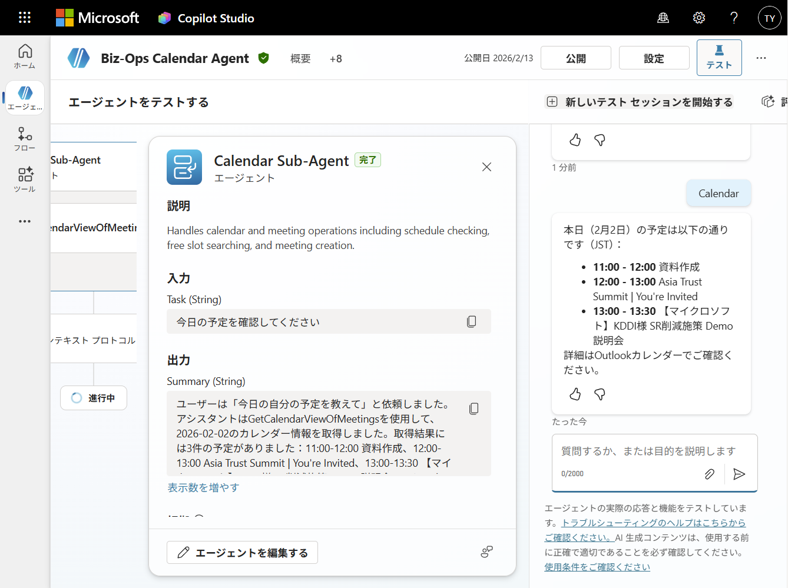
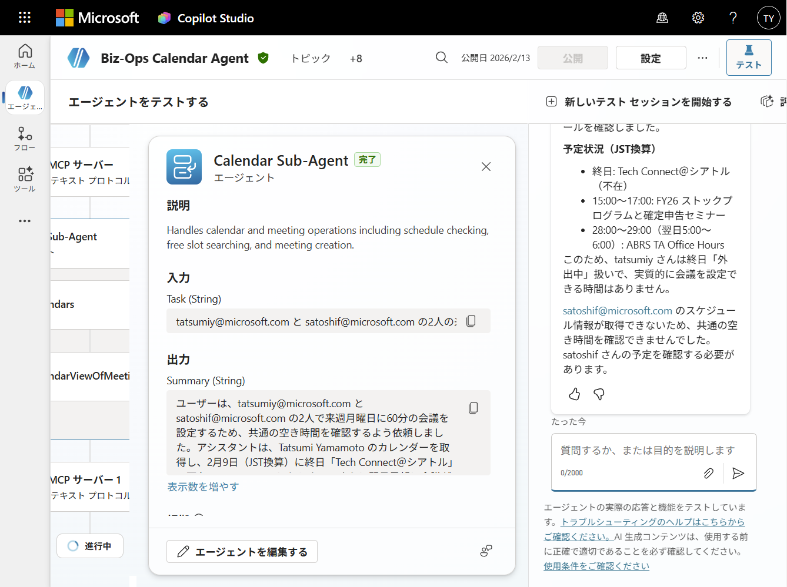
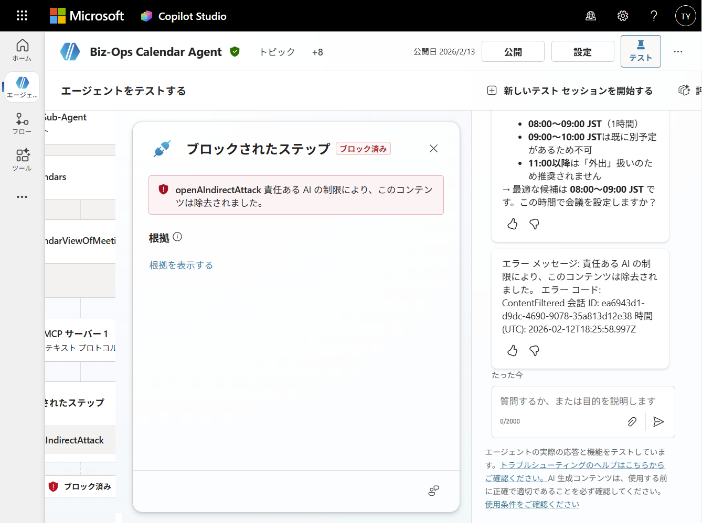
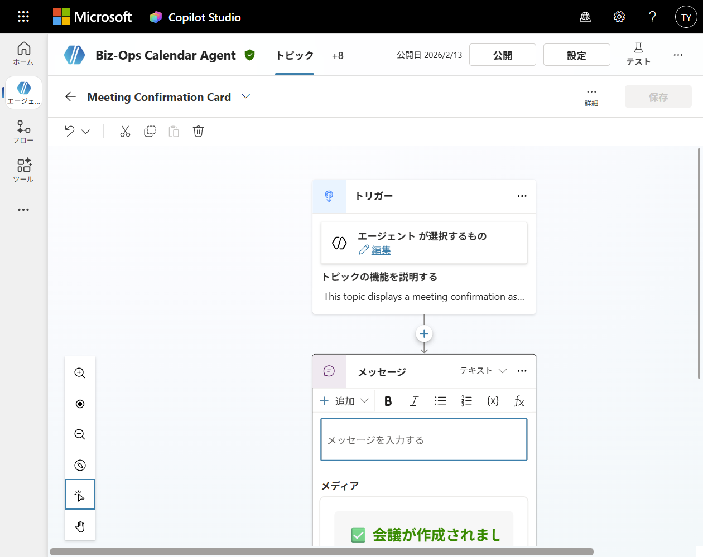

# Biz-Ops Calendar Agent — Smart Scheduling for M365 Copilot

> **Agents League @ TechConnect** — Track 3: Enterprise Agents (Copilot Studio)  
> Connected Agents + Adaptive Cards + Instruction Engineering + Custom MCP Server


## Overview

Biz-Ops Calendar Agent is a **Copilot Studio agent** deployed to **M365 Copilot Chat (Teams)** that provides smart scheduling and email management:

- 🤖 **Connected Agents** — Orchestrator → Calendar Sub-Agent + Email Sub-Agent automatic delegation
- 📅 **Smart Scheduling** — Check your schedule, propose meeting candidates, create Teams meetings
- 🏆 **Adaptive Cards** — Rich meeting confirmation card with FactSet + Teams join button
- 📧 **Email Management** — Send, reply, forward, list, and flag emails
- 🛡️ **DLP Resilience** — Built within real enterprise DLP constraints (5 approaches documented)
- 🔧 **Custom MCP Server** — Calendar MCP Server (TypeScript) with cross-user scheduling (built but blocked by DLP in Copilot Studio; works in VS Code Copilot Chat)

## Architecture

### Copilot Studio Agent (Production — M365 Copilot Chat)

```
M365 Copilot Chat (Teams / Web)
  └── Copilot Studio Agent (Biz-Ops Calendar Agent) — Orchestrator/Router
        ├── Calendar Sub-Agent (Connected Agent)
        │     └── Meeting Management MCP Server (Office 365 Outlook Connector)
        │           └── GetCalendarView, CreateMeeting, UpdateMeeting, etc.
        └── Email Sub-Agent (Connected Agent)
              └── Email Management MCP Server (Office 365 Outlook Connector)
                    └── SendEmail, ListEmails, ReplyToEmail, FlagEmail, etc.
```

## DLP Challenge & What We Learned

> **Enterprise environments impose DLP (Data Loss Prevention) policies** that restrict which connectors can be used in Power Platform. This project encountered real-world DLP constraints and documents the findings.

| What We Tried                                           | Result     | Root Cause                                                       |
| ------------------------------------------------------- | ---------- | ---------------------------------------------------------------- |
| Custom MCP endpoint (Dev Tunnel / Azure Container Apps) | ❌ Blocked | DLP policy blocks custom MCP endpoints                           |
| Microsoft MCP Servers (Agent 365 Outlook Calendar MCP)  | ❌ Blocked | Premium connector, blocked by `Personal Developer (default)` DLP |
| HTTP connector (Premium)                                | ❌ Blocked | Premium connector, same DLP policy                               |
| Power Automate agent flow (Graph API getSchedule)       | ❌ Blocked | O365 Outlook "Send HTTP request" also restricted by DLP          |
| **Office 365 Outlook connector (Standard tools only)**  | **✅ OK**  | Standard connector in Business data group                        |

**What We Could Use**: Only the standard built-in tools of the Office 365 Outlook connector (GetCalendarView, CreateMeeting, etc.) — these are limited to the **current user's own calendar**.

**Workaround**: Since cross-user availability (`getSchedule`) was blocked, the agent proposes meeting candidates based on the user's own free time and lets attendees accept/decline via the Teams meeting invite. The Custom MCP Server in this repo implements the full cross-user scheduling flow and works in VS Code Copilot Chat.

## Copilot Studio Components

| Component              | Type                   | Description                                                    |
| ---------------------- | ---------------------- | -------------------------------------------------------------- |
| Biz-Ops Calendar Agent | Parent Agent (Router)  | Routes requests to Calendar or Email Sub-Agent                 |
| Calendar Sub-Agent     | Connected Agent        | Schedule lookup, meeting creation, candidate proposal          |
| Email Sub-Agent        | Connected Agent        | Email send, reply, forward, list, flag                         |
| Meeting Confirmation   | Topic (Adaptive Card)  | Rich card with FactSet + Action.OpenUrl after meeting creation |
| Meeting Management MCP | O365 Outlook Connector | GetCalendarView, CreateMeeting (9 tools)                       |
| Email Management MCP   | O365 Outlook Connector | SendEmail, ListEmails (6 tools)                                |

## Connected Agents — Multi-Agent Orchestration

The core of this project is the **Connected Agents** pattern in Copilot Studio — a parent agent (Orchestrator) that automatically delegates tasks to specialized sub-agents.

### How Orchestrator Routing Works

The Orchestrator uses **Instruction-based routing** to decide which sub-agent handles each request:

```
Orchestrator Instructions (excerpt):
"Automatically use the Calendar Sub-Agent for scheduling, meetings,
and availability requests. Use the Email Sub-Agent for email-related tasks.
Choose the right sub-agent without asking the user."
```

No manual topic routing or keyword matching needed — the LLM understands intent and delegates automatically.

### Calendar Sub-Agent — Multi-Step Reasoning

The Calendar Sub-Agent performs complex multi-step workflows via Instructions:

1. **GetCurrentDateTime** (mandatory first step) — Anchors date calculations to prevent hallucination
2. **GetCalendarViewOfMeetings** — Fetches the user's own schedule for the requested period
3. **Analyze free time** — Identifies available time slots from the calendar data
4. **Present candidates** — Shows 3 time slot candidates to the user
5. **User confirmation** — Waits for user to pick a slot (never creates meetings without explicit approval)
6. **CreateMeeting** — Creates Teams meeting with online link (`isOnlineMeeting=true`)
7. **Meeting Confirmation Card** — Displays Adaptive Card with meeting details + Teams join button

### Email Sub-Agent

Handles email operations via Office 365 Outlook connector — send, reply, forward, list, and flag emails.

### Instruction Engineering Highlights

| Challenge                              | Solution in Instructions                                        |
| -------------------------------------- | --------------------------------------------------------------- |
| Sub-agent asks "Which calendar ID?"    | Force `calendar_id="Calendar"` always                           |
| Date hallucination (wrong "next week") | Mandatory `GetCurrentDateTime` first + calculation examples     |
| JSON metadata leaking to user          | "Never output raw JSON or tool call explanations"               |
| Accidental meeting creation            | 3-step mandatory workflow: check → propose → confirm            |
| Content moderation false positives     | Natural language style instead of `## RULE` / `Do NOT` patterns |

## Demo Scenarios

### 1. Check My Schedule

```
User: "Show me today's schedule"

→ Orchestrator → Calendar Sub-Agent
→ GetCalendarViewOfMeetings (Meeting Management MCP / O365)
→ Returns today's meetings with times and subjects
```

### 2. Schedule a Meeting ⭐

```
User: "Find free 30-minute slots next week"

Step 1: GetCurrentDateTime → Anchor today's date
Step 2: GetCalendarViewOfMeetings → Fetch next week's schedule
Step 3: Analyze free time and present candidates
        📅 Candidate 1: 2/17 (Mon) 10:00 - 10:30
        📅 Candidate 2: 2/17 (Mon) 14:00 - 14:30
        📅 Candidate 3: 2/18 (Tue) 11:00 - 11:30
Step 4: User: "Go with #1. Title: Team Sync"
Step 5: CreateMeeting (calendar_id="Calendar", isOnlineMeeting=true)
Step 6: ✅ Meeting Confirmation Card (Adaptive Card) — subject, date/time, attendees, Teams link
```

### 3. Email Operations

```
User: "Show me 5 unread emails"

→ Orchestrator → Email Sub-Agent
→ Email Management MCP (O365 Outlook)
→ Returns sender, subject, received date
```

## Screenshots

|                          Self Calendar                           |                      E2E Scheduling                      |                   Copilot Studio                   |
| :--------------------------------------------------------------: | :------------------------------------------------------: | :------------------------------------------------: |
|  |  |  |

|                 Adaptive Card (Copilot Studio)                 |
| :------------------------------------------------------------: |
|  |

## Business Value

- **Universal Pain Point** — Meeting scheduling is a daily challenge for every knowledge worker
- **Enterprise-Ready** — Built within real DLP constraints, not in an idealized environment
- **Instruction Engineering** — Mandatory 3-step meeting creation workflow (check → propose → confirm) prevents accidental meeting creation
- **DLP Documentation** — Documents real enterprise DLP challenges and workarounds that other teams can reference
- **Connected Agents Pattern** — Reusable multi-agent orchestration architecture for Copilot Studio

## Custom MCP Server (calendar-mcp-server/)

> ⚠️ **Note**: This MCP server was built to enable cross-user scheduling via Graph API's `getSchedule`, but **DLP policy blocked all attempts to connect it to Copilot Studio**. It is included in this repo as a working implementation and can be used with VS Code Copilot Chat.

| Tool                    | Description                                   | Read/Write | Adaptive Card                |
| ----------------------- | --------------------------------------------- | ---------- | ---------------------------- |
| `get_schedule`          | Fetch attendee availability via Graph API     | Read       |                              |
| `find_available_slots`  | Find common free time slots (tentative-aware) | Read       | ✅ Slot candidates card      |
| `create_event`          | Create a Teams meeting event                  | Write      | ✅ Meeting confirmation card |
| `get_current_date_time` | Get current date/time in UTC and JST          | Read       |                              |

### Adaptive Cards

Adaptive Cards are implemented in **both Copilot Studio and the MCP server**:

- **Copilot Studio**: "Meeting Confirmation Card" topic with FactSet + Action.OpenUrl — displays meeting title, date/time, attendees, duration, and Teams join button as a rich card in Teams chat
- **MCP Server**: `findSlots` and `createEvent` tools generate Adaptive Card JSON alongside structured data

Sample templates are available in [`docs/adaptive-cards/`](docs/adaptive-cards/) for reference.

|         Slot Candidates          |      Meeting Confirmation       |
| :------------------------------: | :-----------------------------: |
| 📅 Available Slot Candidates (3) | ✅ Meeting Created Successfully |

**Tech Stack**: MCP SDK v1.26, Express, Streamable HTTP, Zod v4, API Key auth (`crypto.timingSafeEqual`)

> ⚠️ **DLP Limitation**: This MCP server works in VS Code Copilot Chat for local development, but **cannot be connected to Copilot Studio** due to the tenant's DLP policy blocking custom MCP endpoints and premium connectors. In a DLP-unrestricted environment, this server would provide full cross-user scheduling capabilities directly in Copilot Studio.

## Setup Guide

### Prerequisites

- M365 Copilot license (for Copilot Studio + M365 Copilot Chat)
- Node.js 20+ (for local MCP server)
- Entra ID App Registration with Graph API permissions (for local MCP server):
  - `Calendars.Read`, `Calendars.ReadWrite`, `User.Read.All` (Application)

### Quick Start (Local MCP Server)

```bash
cd calendar-mcp-server
npm install

# Create .env with your Entra ID App credentials
# (AZURE_TENANT_ID, AZURE_CLIENT_ID, AZURE_CLIENT_SECRET, MCP_API_KEY)

npm run dev
# → http://localhost:3001/mcp
```

### Copilot Studio Setup

1. Go to [copilotstudio.microsoft.com](https://copilotstudio.microsoft.com)
2. Create agent "Biz-Ops Calendar Agent"
3. Add tools: Meeting Management MCP + Email Management MCP (O365 Outlook)
4. Create Connected Agents: Calendar Sub-Agent, Email Sub-Agent
5. Configure Instructions for Orchestrator, Calendar Sub-Agent, Email Sub-Agent
6. Publish → Channels → Teams and Microsoft 365 Copilot

> ⚠️ **DLP Note**: Custom MCP endpoints, Microsoft MCP Servers (Agent 365), and Power Automate HTTP actions may be blocked by your tenant's DLP policy. The standard Office 365 Outlook connector tools (GetCalendarView, CreateMeeting, etc.) work within DLP constraints.

## Project Structure

```
├── calendar-mcp-server/                 # Custom MCP server (TypeScript)
│   ├── src/
│   │   ├── index.ts                     # Express + API Key Auth + Streamable HTTP
│   │   ├── graph/
│   │   │   ├── client.ts               # Entra ID app-only auth
│   │   │   └── calendar.ts             # getSchedule, createEvent
│   │   ├── tools/
│   │   │   ├── getSchedule.ts           # Schedule lookup tool
│   │   │   ├── findSlots.ts             # Tentative-aware slot finder
│   │   │   ├── createEvent.ts           # Meeting creation tool
│   │   │   └── getCurrentDateTime.ts    # Current date/time tool
│   │   └── utils/
│   │       └── slotCalculator.ts        # Slot calculation logic
│   ├── package.json
│   └── tsconfig.json
├── docs/
│   ├── adaptive-cards/                      # Adaptive Card JSON templates
│   │   ├── slot-candidates.json             # Slot candidates card
│   │   └── meeting-confirmation.json        # Meeting confirmation card
│   ├── copilot-studio-calendar-sub-agent-instructions.md
│   └── demo-script.md
├── screenshots/                         # Demo screenshots
├── demogif/                             # Demo GIF
├── DISCLAIMER.md
├── CODE_OF_CONDUCT.md
└── README.md
```

## Technical Highlights

**Production Agent (Copilot Studio → M365 Copilot Chat)**:
- **Connected Agents** — Orchestrator → Calendar Sub-Agent + Email Sub-Agent delegation pattern
- **Adaptive Cards** — Meeting Confirmation Card in Copilot Studio (FactSet + Action.OpenUrl)
- **Instruction Engineering** — Mandatory 3-step meeting creation workflow (check → propose → confirm)
- **DLP Resilience** — Tried 5 approaches, documented all findings, built working agent within constraints

**Custom MCP Server (in repo, blocked by DLP in Copilot Studio)**:
- **MCP SDK v1.26** — Streamable HTTP transport, Read + Write tools, Zod v4 schemas
- **Microsoft Graph API** — `getSchedule`, `createEvent` with app-only auth
- **API Key Auth** — `crypto.timingSafeEqual` timing-safe comparison middleware
- **Tentative Handling** — Graph `availabilityView` "1" treated as potential slots with confidence scoring

## Evaluation Criteria (Track 3: Enterprise Agents)

| Criteria                     | Weight | Implementation                                                                                   |
| ---------------------------- | ------ | ------------------------------------------------------------------------------------------------ |
| **Technical Implementation** | 33%    | Connected Agents, Copilot Studio agent, Custom MCP Server with Read + Write tools                |
| **Business Value**           | 33%    | Universal scheduling pain point, enterprise DLP documentation, reusable architecture             |
| **Innovation & Creativity**  | 34%    | DLP constraint navigation, multi-agent orchestration, instruction engineering for safe workflows |

| Technical Item          | Points    | Status                                                                                 |
| ----------------------- | --------- | -------------------------------------------------------------------------------------- |
| M365 Copilot Chat Agent | Pass/Fail | ✅ Copilot Studio → M365 Copilot Chat (Teams)                                          |
| Connected Agents        | 15 pts    | ✅ Calendar Sub-Agent + Email Sub-Agent (multi-agent orchestration)                    |
| External MCP Server     | 8 pts     | ✅ Read + Write tools in repo (works in VS Code; DLP blocks Copilot Studio connection) |
| OAuth Security          | 5 pts     | ✅ API Key auth in MCP server (`crypto.timingSafeEqual`)                               |
| Adaptive Cards          | 5 pts     | ✅ Meeting Confirmation Card in Copilot Studio (FactSet + Action.OpenUrl)              |

## Built With

**Production Agent (Copilot Studio → M365 Copilot Chat)**:
- [Copilot Studio](https://copilotstudio.microsoft.com/) — Connected Agents + Adaptive Cards + Instruction Engineering
- [M365 Copilot Chat (Teams)](https://teams.microsoft.com/) — Production deployment channel
- [Office 365 Outlook Connector](https://learn.microsoft.com/connectors/office365/) — Standard connector (DLP-safe)

**Custom MCP Server (in repo, works in VS Code, blocked by DLP in Copilot Studio)**:
- [Model Context Protocol (MCP)](https://modelcontextprotocol.io/) — MCP SDK v1.26, Streamable HTTP
- [Microsoft Graph API](https://learn.microsoft.com/graph/) — getSchedule, createEvent with app-only auth
- TypeScript, Express, Zod v4

**Development**:
- [GitHub Copilot (VS Code Agent Mode)](https://code.visualstudio.com/docs/copilot/overview) — AI-assisted coding + Playwright browser automation

## Disclaimer

See [DISCLAIMER.md](DISCLAIMER.md)

This project was created during the Agents League @ TechConnect hackathon.  
All data shown in demos uses fictional/dummy data (Contoso, Fabrikam, Northwind).  
No real customer data, PII, or Microsoft Confidential information is included.

---

*Built with ❤️ using GitHub Copilot + VS Code Agent Mode*
